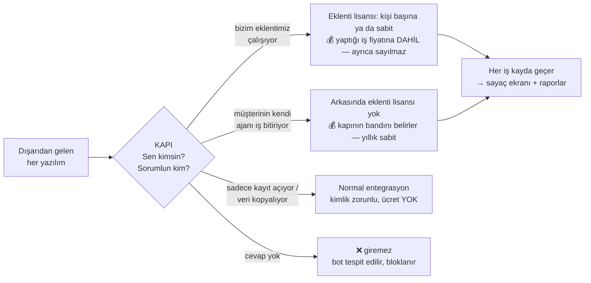

# Yapay Zekâ İş Modeli — Yönetici Özeti ve Karar Listesi

> Levent + Erman için. (25.07.2026 — güncellendi: iki bağımsız model çalışması
> birleştirildi.)
> Teknik doküman (backend yol haritası) ekibin işidir; onu anlamak zorunda
> değilsiniz. Bu sayfada sadece SİZİN vereceğiniz kararlar var.

## Resim

## Aynı resim, sözle

Site güvenliği gibi: içeri giren herkes kapıda "kimim, kime geldim" der ve
deftere yazılır. Cevap veremeyen giremez. Gelir dört kalemden oluşur:

1. **Platform taban bedeli** — teknisyen sayısı ne olursa olsun, sistemi ve
   veriyi kullanmanın yıllık tabanı.
2. **Teknisyen lisansı** — bugünkü gibi, isme yazılı.
3. **AICore eklentileri** — 7 tanesi kişi başına (teknisyen lisansının üstüne
   yıllık sabit ek), kalanı kurum başına sabit. **En önemli madde: eklentinin
   insansız çalışması fiyatına dahildir, ayrıca sayılmaz.** Aldığınız eklenti
   gece de çalışsa toplu da çalışsa fatura değişmez.
4. **GateCoreAI** — zorunlu, kurum başına yıllık sabit. Bandı, müşterinin
   **dışarıdan bağladığı** ajanların insansız bitirdiği işe göre belirlenir.
   Kural tek cümle: *lisansı olan iş sayılmaz, lisansı olmayan iş banda girer.*
   Sayaç bir fatura kalemi değil, bant ölçüsüdür — koltuk saymak gibi.

İki koruma kuralı:

- **Kayıt açan trafik bedava.** E-postadan/izleme sisteminden kayıt açılması,
  veri kopyalama = normal entegrasyon; banda girmez. Banda giren tek şey,
  lisansı olmayan bir yazılımın insansız ÇÖZDÜĞÜ iştir.
- **Çift ücret yok.** Bir iş ya eklenti lisansı kapsamındadır ya banda girer;
  ikisine birden yazılmaz. (ServiceNow modül lisansının üstüne tüketim havuzu
  koydu; yenilemede %50-100 artış ve "opt-out yok" tepkisi aldı. Bizim
  kaçındığımız şey bu.)
- **Sürpriz fatura yok.** Bandın sonuna yaklaşınca haber verilir; otomatik ek
  ücret işlemez, üst banda geçmek imzalı ve sabit bedellidir.

## Sizin vereceğiniz 8 karar

Hepsi fiyat ve kural kararı. Toplantıda sırayla geçin, her birine evet/hayır/rakam verin.

1. **Platform taban bedeli:** bugünkü sözleşmelerde buna denk bir kalem var mı?
   Varsa korunur; yoksa yeni sözleşme ve yenilemelere eklensin mi, ne kadar olsun?

2. **Teknisyen başına ek ücret ne kadar olsun?**
   Pazar referansı: Microsoft ve Freshworks benzer yardımcıyı kullanıcı başına
   ayda 29-30 dolara satıyor — referans, kopya değil. Önerim: koltuk fiyatının
   %20-30'u aralığında başla, pilotta test et.

3. **GateCoreAI bantlarının sınırları?**
   Rakam kilitlemeden önce tek şart: backend'in "sessiz ölçümü" (fatura
   kesmeden sayacı 10-15 müşteride çalıştırıp gerçek hacmi görmek).
   Başlangıç hipotezi: yılda 12.000 / 60.000 / 240.000 dış ajan işi.

4. **GateCoreAI bant fiyatları?**
   Taban: bizim maliyet + kaybolan koltuk gelirinin altına inilmez.
   Hedef: işin insanla yapılma maliyetinin %25-40'ı (yarısı üst sınır).
   Pilotta 2-3 fiyat seviyesi gerçek teklifle denenir, sonra kilitlenir.

5. **Bandın sonuna gelince ne olsun?**
   Öneri: eşiklerde uyarı → sınırda dış ajanın yazma işlemleri durur, iş insan
   kuyruğuna düşer → isteyen önceden üst banda geçer. Sürpriz aşım faturası
   yok. (Kendi eklentilerimiz bu sınırdan etkilenmez.) Onaylıyor musunuz?

6. **Ek ücreti olmayan teknisyene yapay zekâ ne yapabilsin?**
   (a) hiçbir şey — hepsi ücretli, (b) tadımlık: özet/okuma bedava, kayıt
   işleme ücretli. (b) satışı kolaylaştırır, (a) geliri netleştirir.

7. **Mevcut müşterilerin geçiş süresi kaç ay?**
   Eski usül bağlantılar bir süre uyarıyla çalışır, sonra kapanır. "2 sürüm"
   takvimde kaç ay? Ayrıca söz: geriye dönük hiçbir fatura çıkarılmaz.

8. **"Kim ne kadar işi yapay zekâya yaptırıyor" raporu nasıl açılsın?**
   Öneri: varsayılan **ekip bazında** (KVKK ve çalışan barışı için güvenli);
   kişi bazlı görünüm müşterinin isteğine + yetkiye + hukuk onayına bağlı.
   Erman'ın istediği kişi bazlı ekran mümkün — ama varsayılan yapmayalım.
   Karar: bu öneri kabul mü?

## Sizin karar VERMEYECEĞİNİZ şeyler

Anahtar süreleri, tablo isimleri, sayacın teknik kurulumu, tekilleştirme —
backend ekibinin ve benim işim. Onlardan size "bitti, test geçti" raporu
gelir. Anlamadığınız bir teknik satır gördüğünüzde karar sizden beklenmiyor
demektir.

## Not — bir düzeltme

Erman'a giden metinde "SAP, Diageo davasında 54 milyon sterlin" ifadesi
geçmişti. Doğrusu: 54 milyon SAP'nin talebiydi; mahkeme 2017'de sorumluluğa
hükmetti ama tutara hükmetmedi, taraflar sonradan anlaştı. Ders değişmiyor
(sadece insan lisansıyla otomasyon çağı yönetilemiyor, SAP makine işine ayrı
ölçü getirdi) ama rakamı mahkeme kararı gibi anmayalım.
